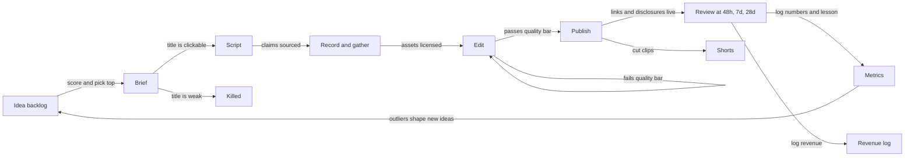

# Video pipeline

Stages and exit conditions are defined in [../PIPELINE.md](../PIPELINE.md).

```mermaid
flowchart LR
    I["Idea backlog"] -->|"score and pick top"| B["Brief"]
    B -->|"title is clickable"| S["Script"]
    B -->|"title is weak"| K["Killed"]
    S -->|"claims sourced"| R["Record and gather"]
    R -->|"assets licensed"| E["Edit"]
    E -->|"passes quality bar"| P["Publish"]
    E -->|"fails quality bar"| E
    P -->|"links and disclosures live"| V["Review at 48h, 7d, 28d"]
    P -->|"cut clips"| SH["Shorts"]
    V -->|"log numbers and lesson"| M["Metrics"]
    V -->|"log revenue"| RV["Revenue log"]
    M -->|"outliers shape new ideas"| I
```
